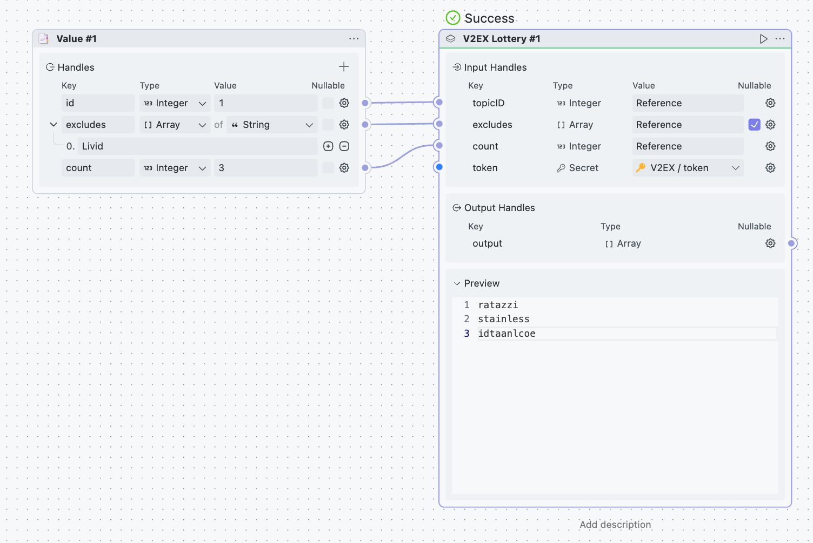
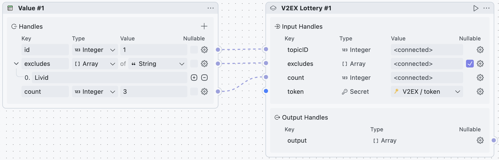
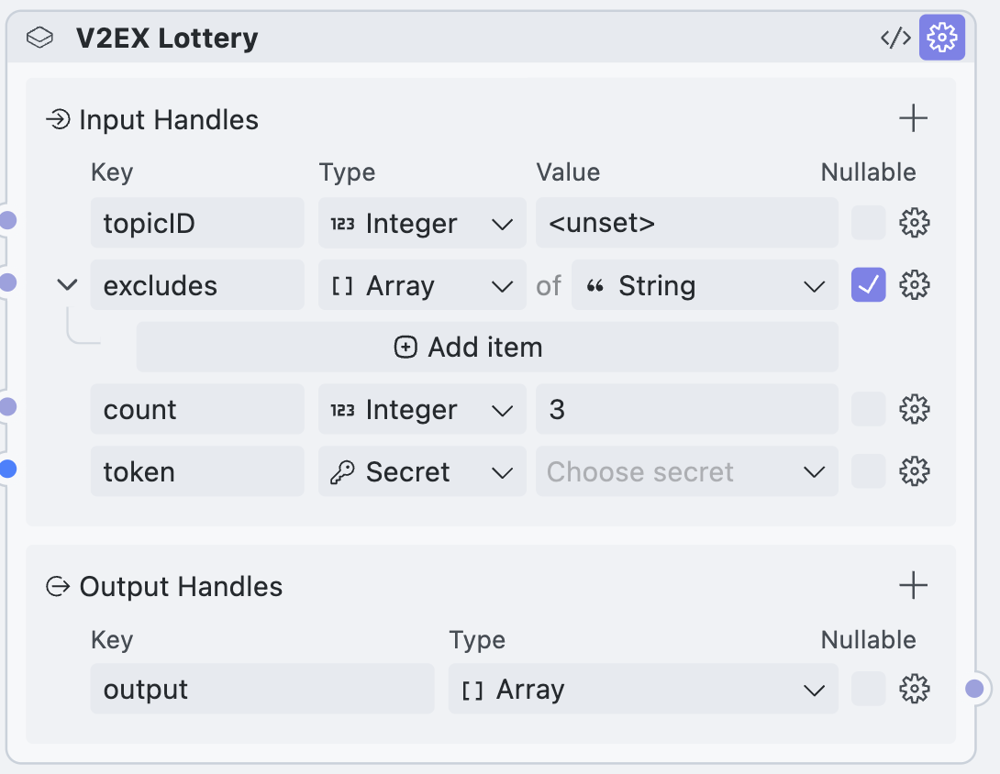

  <h1>V2EX Lottery</h1>
  

    
  

  

Used for the V2EX lottery, implemented based on the official V2EX [REST API](https://www.v2ex.com/help/api).

Extract all replies from specific V2EX posts, and perform deduplication and filtering. Suitable for random reply layer lotteries.

Internally, a shuffling algorithm is used. Since `Math.random()` is not a secure random number generator, the results will be shuffled 10 times to reduce impact.

## Flows

### lottery

* **id**: `Integer` - Used to specify the ID of the V2EX post
* **excludes**: `Array<String>` - Used to exclude specific users
* **count**: `Integer` - Number of winners
* **token**: `Secret` - V2EX token, which can be generated at <https://v2ex.com/settings/tokens>

## Share Block

### v2ex-lottery

* **topicID**: `Integer` - Used to specify the ID of the V2EX post
* **excludes**: `Array<String>` - Used to exclude specific users
* **count**: `Integer` - Number of winners
* **token**: `Secret` - V2EX token, which can be generated at <https://v2ex.com/settings/tokens>
* **output**: `Array<String>` - List of winners