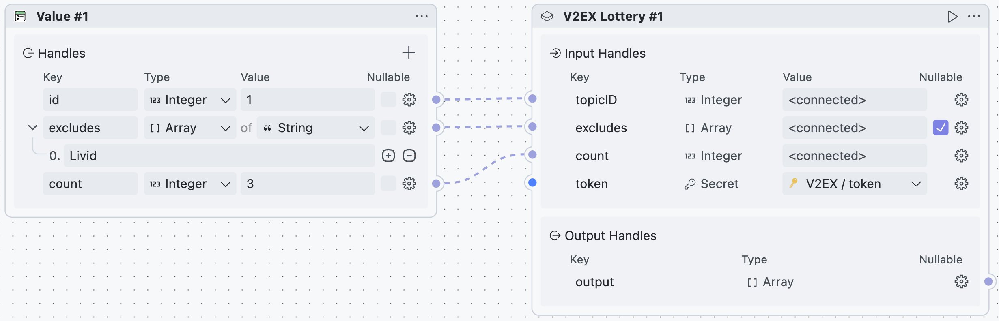
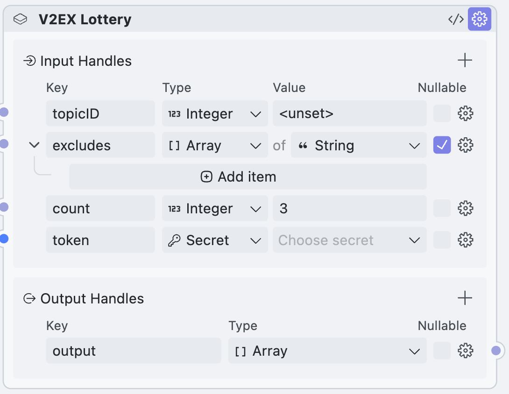

  <h1>V2EX Lottery</h1>
  

    
  

  

用于 V2EX 抽奖，基于官方 V2EX [REST API](https://www.v2ex.com/help/api) 实现。

从特定的 V2EX 帖子中提取所有回复，并进行去重和过滤。适合随机回复层的抽奖。

内部使用了洗牌算法。由于 `Math.random()` 不是一个安全的随机数生成器，因此结果将洗牌 10 次以减少影响。

## Flows

### lottery

* **id**: `Integer` - 用于指定 v2ex 帖子的 id
* **excludes**: `Array<String>` - 用于排除特定用户
* **count**: `Integer` - 得奖人数
* **token**: `Secret` - v2ex 的 token，可以在 <https://v2ex.com/settings/tokens> 中生成

## Share Block

### v2ex-lottery

* **topicID**: `Integer` - 用于指定 v2ex 帖子的 id
* **excludes**: `Array<String>` - 用于排除特定用户
* **count**: `Integer` - 得奖人数
* **token**: `Secret` - v2ex 的 token，可以在 <https://v2ex.com/settings/tokens> 中生成
* **output**: `Array<String>` - 得奖名单